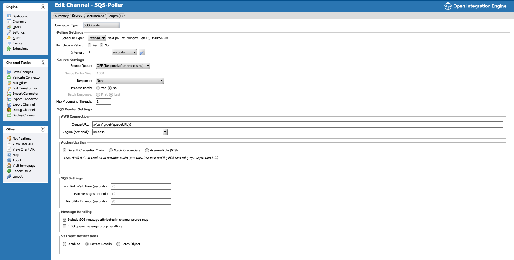

# OIE SQS Source Connector

An Open Integration Engine (OIE) source connector plugin that polls AWS SQS queues for messages.



## Features

- Long polling with configurable wait time, max messages, and visibility timeout
- All AWS authentication methods: Default Credential Chain, Static Credentials, Assume Role (STS)
- Standard and FIFO queue support with message group handling
- S3 event notification support (EventBridge and standard S3 notification formats, with SNS envelope auto-detection)
- Fetch S3 objects directly as message content with configurable file type (Text/Binary) and encoding
- S3 object metadata and user-defined metadata added to source map
- SQS message attributes and system attributes in source map
- All text fields support replacement variables (Velocity expressions)
- Delete retry with configurable attempts on transient failures

## Requirements

- OIE 4.5.2+
- Java 17+

## Building

Requires OIE libraries in your Maven repository.

```bash
mvn clean package
```

The plugin zip will be in `package/target/sqs-connector-1.0.0.zip`.

## Installation

Install using the Extensions manager in the OIE Administrator, or manually extract
to the `extensions` directory. A restart is required after installation.

## Configuration

### AWS Connection
- **Queue URL** (required): Full SQS queue URL
- **Region** (optional): AWS region. If blank, uses the default region from the AWS credential provider chain

### Authentication
- **Default Credential Chain**: Uses environment variables, instance profile, ECS task role, `~/.aws/credentials`
- **Static Credentials**: Explicit AWS Access Key ID and Secret Access Key
- **Assume Role (STS)**: Assume an IAM role with optional external ID

### SQS Settings
- **Long Poll Wait Time**: 0-20 seconds (higher values reduce API costs)
- **Max Messages Per Poll**: 1-10 messages per request
- **Visibility Timeout**: 0-43200 seconds (should exceed expected processing time)

### Message Handling
- **Include SQS message attributes**: Adds user-defined and system attributes to the source map
- **FIFO queue message group handling**: Includes MessageGroupId and SequenceNumber in source map

### S3 Event Notifications
- **Disabled**: Treat SQS message body as-is
- **Extract Details**: Parse S3 event JSON, add bucket/key/event details to source map, keep original SQS body
- **Fetch Object**: Parse S3 event JSON, add details to source map, and replace message body with the fetched S3 object content
  - **Max Object Size (KB)**: Objects larger than this are skipped (0 = no limit)
  - **File Type**: Text (decoded to string) or Binary (raw bytes)
  - **Encoding**: Fallback encoding when the S3 object's Content-Type header does not specify a charset. Content-Type charset is always tried first.

## Source Map Variables

### SQS Variables
| Key | Description |
|-----|-------------|
| `sqsMessageId` | SQS message ID |
| `sqsReceiptHandle` | Receipt handle for message deletion |
| `sqsMD5OfBody` | MD5 hash of the message body |
| `sqsAttr*` | System attributes (e.g. `sqsAttrSentTimestamp`) |
| `sqsMessageGroupId` | FIFO queue message group ID |
| `sqsSequenceNumber` | FIFO queue sequence number |
| `sqsMsgAttr*` | User-defined message attributes (e.g. `sqsMsgAttrMyKey`) |

### S3 Event Variables
| Key | Description |
|-----|-------------|
| `s3EventName` | Event name (e.g. `ObjectCreated:Put`) |
| `s3EventFormat` | `EventBridge` or `S3Notification` |
| `s3BucketName` | S3 bucket name |
| `s3BucketArn` | S3 bucket ARN |
| `s3ObjectKey` | S3 object key (URL-decoded) |
| `s3ObjectSize` | Object size in bytes |
| `s3ObjectETag` | Object ETag |
| `s3ObjectVersionId` | Object version ID (if versioned) |
| `s3Region` | AWS region from the event |

### S3 Object Metadata (Fetch Object mode)
| Key | Description |
|-----|-------------|
| `s3ContentType` | Content-Type header |
| `s3ContentLength` | Content length in bytes |
| `s3ContentEncoding` | Content encoding |
| `s3LastModified` | Last modified timestamp |
| `s3StorageClass` | Storage class |
| `s3ServerSideEncryption` | Server-side encryption type |
| `s3CacheControl` | Cache-Control header |
| `s3ContentDisposition` | Content-Disposition header |

User-defined S3 object metadata (`x-amz-meta-*` headers) is added to the source map using the original key names.

## License

MIT License
