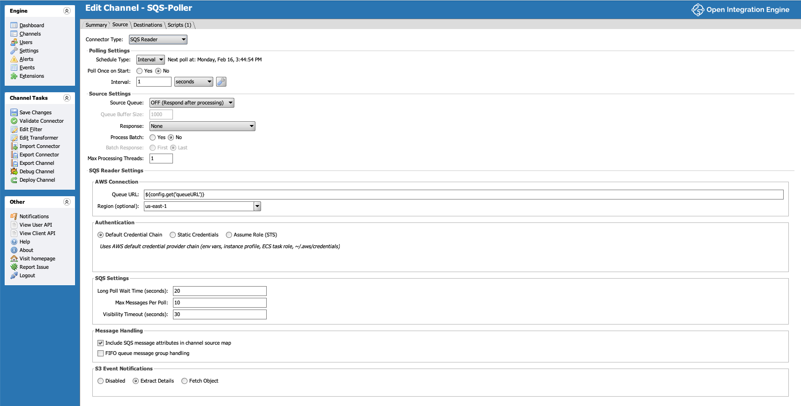

# OIE SQS Connector

An Open Integration Engine (OIE) connector plugin for AWS SQS, providing both a
source connector (SQS Reader) that polls queues for messages and a destination
connector (SQS Sender) that sends messages to queues.



## Web Administrator support

This plugin ships UI for **all three** OIE surfaces:

- **Server**: `server/` (SqsReceiver / SqsDispatcher)
- **Swing Administrator**: `client/` (SqsReceiverPanel / SqsSenderPanel)
- **Web Administrator**: `package/webadmin/` — a web admin plugin
  (`plugin.json` + `web/plugin.js`) bundled into the extension zip under
  `sqs-connector/webadmin/`. It registers the "SQS Reader" / "SQS Sender"
  connector panels using the web administrator's plugin API.

The web administrator discovers it automatically when its plugin search path
includes the engine's extensions directory — set
`WEBADMIN_PLUGIN_DIRS=/path/to/oie/extensions` (or `"pluginDirs"` in the web
administrator's `config.json`). No separate install step: installing this
extension on the engine makes it available to both administrators.

Note: `package/webadmin/` is copied into the zip **without** Maven resource
filtering (see the `copy-webadmin` execution in `package/pom.xml`) so Velocity
tokens like `${message.encodedData}` in the JavaScript survive the build.

## Features

### SQS Reader (source)
- Long polling with configurable wait time, max messages, and visibility timeout
- All AWS authentication methods: Default Credential Chain, Static Credentials, Assume Role (STS)
- Standard and FIFO queue support with message group handling
- S3 event notification support (EventBridge and standard S3 notification formats, with SNS envelope auto-detection)
- Fetch S3 objects directly as message content with configurable file type (Text/Binary) and encoding
- S3 object metadata and user-defined metadata added to source map
- SQS message attributes and system attributes in source map
- Connection and fetch settings support replacement variables (Velocity expressions)
- Text batch splitting through the engine batch adaptor
- Delete retries: three attempts, one second apart
- Queue inspection from either administrator without consuming messages

### SQS Sender (destination)
- Send messages to Standard and FIFO queues
- All AWS authentication methods: Default Credential Chain, Static Credentials, Assume Role (STS)
- Configurable message body template (defaults to `${message.encodedData}`)
- FIFO message group ID and deduplication ID support; standard-queue group IDs enable fair queues
- Up to ten typed message attributes (String, Number, or Binary) with per-message replacement
- Optional delivery delay for standard queues
- Per-message replacement variables for queue URL, body, delay, and FIFO IDs
- Works with OIE destination queueing/retry settings (failed sends are queued)

## Requirements

- Server and Swing Administrator: declared compatibility with OIE 4.5.2 and 4.6.0
- Community Store and Web Administrator: OIE 4.6.0+
- Java 17+

## Building

Requires OIE libraries in your Maven repository.

```bash
mvn clean verify
python3 -m unittest discover -s tools -p 'test_*.py' -v
python3 tools/check_package.py
```

The plugin zip will be in `package/target/sqs-connector-<version>.zip` (currently
`1.0.1`). The build runs Java regression tests and tests against the built web
bundle. The package check verifies library references, API registrations, version
consistency, and exclusion of test/build tooling from the extension. Tests do not
require AWS credentials or contact AWS.

The extension ships four JARs: its shared, server and client modules, plus the
SQS service module from AWS SDK 2.15.28. OIE supplies the matching shared SDK,
STS/S3, HTTP, Jackson and logging libraries. The package check rejects additional
JARs and mismatched library registrations. Assembly uses resolved dependencies
rather than a cached library directory, so older build output cannot reintroduce
the redundant libraries.

## Installation

Install using the Extensions manager in the OIE Administrator, or manually extract
to the `extensions` directory. A restart is required after installation.

## Configuration — SQS Reader (source)

### AWS Connection
- **Queue URL** (required): Full SQS queue URL
- **Region** (optional): AWS region. If blank, uses the AWS default region provider chain

### Authentication
- **Default Credential Chain**: Uses environment variables, instance profile, ECS task role, `~/.aws/credentials`
- **Static Credentials**: Explicit AWS Access Key ID and Secret Access Key
- **Assume Role (STS)**: Assume an IAM role with optional external ID

### SQS Settings
- **Long Poll Wait Time**: 0-20 seconds (higher values reduce API costs)
- **Max Messages Per Poll**: 1-10 messages per request
- **Visibility Timeout**: 0-43200 seconds (should exceed expected processing time)

### Message Handling
- **Include SQS message attributes**: Adds user-defined and system attributes to the source map
- **FIFO source-order handling**: Requires Source Queue OFF and one source processing thread. Stops processing later messages in a group after an earlier message in that receive batch fails. Group ID and sequence number remain available in the source map regardless of this setting. This setting does not control destination queue ordering.
- **Process Batch**: Uses the selected text data type's batch splitter. An empty batch, failed split, or failed dispatch leaves the SQS message available for retry. Binary S3 content cannot be batch split.

### S3 Event Notifications
- **Disabled**: Treat SQS message body as-is
- **Extract Details**: Parse S3 event JSON, add bucket/key/event details to source map, keep original SQS body
- **Fetch Object**: Parse S3 event JSON, add details to source map, and replace message body with the fetched S3 object content
  - **Max Object Size (KB)**: Enforced against the fetched response and bytes actually read. When exceeded, the original notification JSON is delivered with `s3FetchStatus=OVERSIZED` and `s3FetchLimitBytes`; a successful dispatch can acknowledge it. Zero (or blank) disables the limit, so choose a finite limit for bounded memory use.
  - **File Type**: Text (decoded to string) or Binary (raw bytes)
  - **Encoding**: Fallback when Content-Type has no usable charset. Quoted charset values are supported.

When an event includes a version ID, the read targets that version. Otherwise an
ETag, when present, is used as a conditional read. Fetch failures, including an
ETag mismatch, emit an engine source error and retain the notification for retry.
Known object-removal events deliver the original notification without an S3 read,
with `s3FetchStatus=NOT_APPLICABLE`. Fetched metadata comes from the same GET
response as the content. Without either
a version ID or ETag, the event cannot pin an object revision.

## Configuration — SQS Sender (destination)

### AWS Connection
- **Queue URL** (required): Full SQS queue URL — supports per-message replacement variables
- **Region** (optional): AWS region. If blank, uses the AWS default region provider chain

### Authentication
Same options as the SQS Reader: Default Credential Chain, Static Credentials, or Assume Role (STS).

### Send Settings
- **Delay Seconds** (optional): Delivery delay 0-900 seconds. Leave blank to use the queue default. Not supported on FIFO queues
- **Message Group ID**: Required for FIFO queues. On standard queues, a group ID enables fair-queue scheduling; it does not add FIFO ordering.
- **FIFO Deduplication ID** (optional): Leave blank if the queue uses content-based deduplication

### Message Body Template
The SQS message body to send. Defaults to `${message.encodedData}` (the transformed
channel message). Any replacement variables are resolved per message.

Configuration-map values are exposed as top-level keys: use `${queueUrl}` or
`${mySetting}`, not `${configMap.queueUrl}`. Source settings and connection/auth
settings resolve when the connector starts. Sender queue URL, body, delay, group
IDs, and attribute names/values resolve for each message.

The SQS `MessageId` returned by AWS is stored as the destination response data.

Use a stable business identifier such as `${eventId}` for FIFO deduplication when
content-based deduplication is disabled. Preserve it across retries; generating a
new random ID per attempt defeats deduplication. Standard queues can duplicate a
send if AWS accepted it but the response was lost.

### Message attributes

Add rows in the sender's **Message Attributes** editor in either administrator:

| Field | Meaning |
|-------|---------|
| Name | Unique SQS attribute name; supports per-message replacement |
| Type | `String`, `Number`, or `Binary` |
| Value | Text, numeric text, or Base64-encoded binary; supports per-message replacement |

For example, use `tenantId` / `String` / `${tenantId}` for routing, or `attempt` /
`Number` / `${attempt}` for a retry count. Attribute values are separate from the
message body. Binary input is decoded before sending. The sender validates the
resolved names, duplicate names, values, maximum ten attributes, and combined
1 MiB body-plus-attributes API limit before calling AWS. A queue may have a lower
configured size limit; **Inspect Queue** reports it. Previously saved channels
without attributes continue to send without them.

## Inspect Queue and permissions

**Inspect Queue** uses the current unsaved connection settings and the engine's
credentials to call `GetQueueAttributes` with `All` on the supplied Queue URL, so
standard queues are not asked explicitly for FIFO-only attributes. It reports the
queue ARN, FIFO/deduplication settings, delays and timeouts, size and retention
limits, approximate message counts, redrive policy, and KMS key when available.
It never receives, sends, deletes, or changes messages. A successful inspection
does not establish permission to perform those operations or decrypt messages.
Per-message-only variables need a concrete value for inspection; configuration
map expressions resolve in the current channel context. A result is discarded
if the settings or selected connector change while the request is running.

The inspector needs **`sqs:GetQueueAttributes`** on the configured queue. It does
not need `sqs:ListQueues` or `sqs:GetQueueUrl`. Restricted engine roles also need
**Inspect SQS Queue** and access to the selected channel. Assume Role still needs
`sts:AssumeRole` and the target role's trust policy, as it does for normal operation.

| Operation | AWS permissions |
|-----------|-----------------|
| Reader | `sqs:ReceiveMessage`, `sqs:DeleteMessage`, `sqs:GetQueueAttributes` (startup check) |
| Sender | `sqs:SendMessage` |
| Inspector | `sqs:GetQueueAttributes` |
| S3 fetch | `s3:GetObject`, or `s3:GetObjectVersion` for a versioned read |

Encrypted queues/objects may also require KMS access under their key policies.
Scope permissions to the queues, objects, and keys used by the channel.

## Delivery and failures

SQS messages are acknowledged after successful engine admission and dispatch
cleanup. With Source Queue ON, admission means persistence to the source queue;
it does not mean destinations have finished. Dispatch, S3-fetch, receive, and
exhausted delete failures are reported as engine source errors. A failed delete
leaves the message eligible for redelivery. The receiver does not extend the
visibility timeout, so set it longer than the expected processing time.

SQS delivery and multi-record/batch processing are at least once. If a later
record fails after earlier records were admitted, retrying the notification may
repeat those earlier records. Make downstream side effects idempotent. The FIFO
source-order setting requires Source Queue OFF and one source processing thread;
destination queue settings must be considered separately.

Normal SQS/S3 API calls use a 60-second attempt timeout and 120-second call timeout.
Queue inspection and STS calls use 10-second attempt and 30-second call timeouts.
Credential/region discovery is separate from those API deadlines.

## Source Map Variables

### SQS Variables
| Key | Description |
|-----|-------------|
| `sqsMessageId` | SQS message ID |
| `sqsReceiptHandle` | Receipt handle for message deletion |
| `sqsMD5OfBody` | MD5 hash of the message body |
| `sqsAttr*` | System attributes (e.g. `sqsAttrSentTimestamp`) |
| `sqsMessageGroupId` | FIFO queue message group ID |
| `sqsSequenceNumber` | FIFO queue sequence number |
| `sqsMsgAttr*` | User-defined attribute values (e.g. `sqsMsgAttrMyKey`); Binary values are Base64 text |
| `sqsMessageAttributeTypes` | Map from attribute name to its AWS data type |

### S3 Event Variables
| Key | Description |
|-----|-------------|
| `s3EventName` | Event name (e.g. `ObjectCreated:Put`) |
| `s3EventFormat` | `EventBridge` or `S3Notification` |
| `s3BucketName` | S3 bucket name |
| `s3BucketArn` | S3 bucket ARN |
| `s3ObjectKey` | S3 object key (URL-decoded) |
| `s3ObjectSize` | Object size in bytes |
| `s3ObjectETag` | Object ETag |
| `s3ObjectVersionId` | Object version ID (if versioned) |
| `s3Region` | AWS region from the event |

### S3 Object Metadata (Fetch Object mode)
| Key | Description |
|-----|-------------|
| `s3FetchStatus` | `FETCHED`, `OVERSIZED` for a size-limit fallback, or `NOT_APPLICABLE` for an object-removal notification |
| `s3FetchLimitBytes` | Configured cap when `s3FetchStatus` is `OVERSIZED` |
| `s3FetchedObjectETag` | ETag from the fetched response; event ETag is preserved separately |
| `s3FetchedObjectVersionId` | Version from the fetched response; event version is preserved separately |
| `s3ContentType` | Content-Type header |
| `s3ContentLength` | Content length in bytes |
| `s3ContentEncoding` | Content encoding |
| `s3LastModified` | Last modified timestamp |
| `s3StorageClass` | Storage class |
| `s3ServerSideEncryption` | Server-side encryption type |
| `s3CacheControl` | Cache-Control header |
| `s3ContentDisposition` | Content-Disposition header |

User-defined S3 object metadata (`x-amz-meta-*` headers) is added to the source map using the original key names.

## License

[Mozilla Public License 2.0](LICENSE) (`MPL-2.0`) for the plugin code.
Third-party dependencies retain their own licenses.
